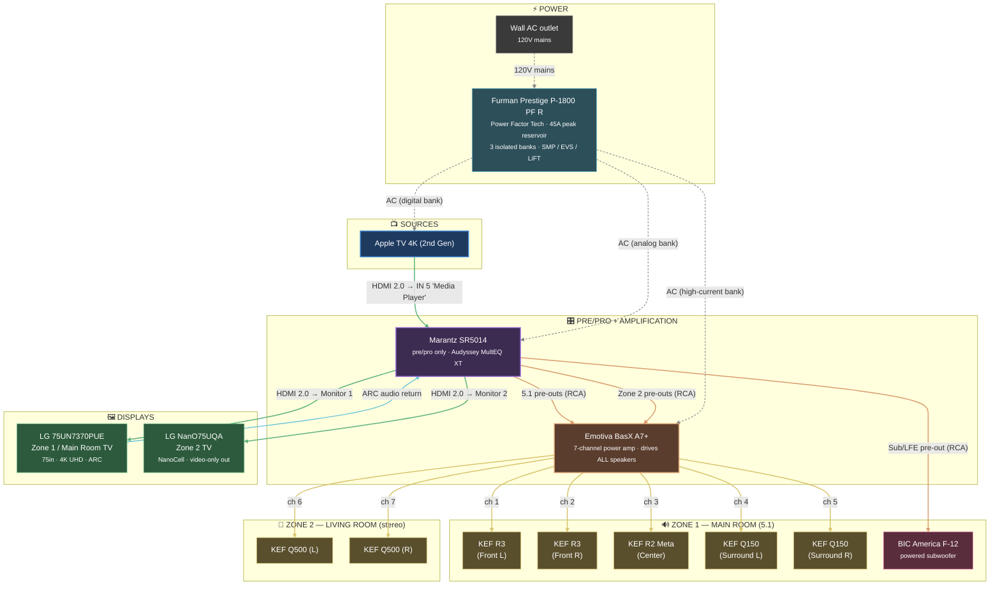

# Signal Chain

**Architectural rule for this system: NO speaker is driven by the Marantz SR5014's internal amps.** All amplification — main room AND Zone 2 — comes from the single Emotiva BasX A7+. The SR5014 functions purely as a pre/pro and switching hub.

**TV audio return is ARC, not eARC** (verified 2026-04-26 — the LG 75UN7370PUE is a 2020 UN73-class TV which only supports ARC). Sufficient for compressed Dolby Digital / DTS from TV apps and the built-in tuner.

## Unified Topology

Single view of every signal path in the system — sources at the top, pre/pro + amplification in the middle, speakers / displays / power as endpoints. Renders natively in Gitea and GitHub. Edge colors indicate signal type (see legend).



### Legend

| Color | Signal type |
|---|---|
| 🟢 Green | HDMI video (source → SR5014, SR5014 → TVs) |
| 🩵 Cyan | ARC audio return (Zone 1 TV apps/tuner audio back into SR5014) |
| 🟠 Orange | Balanced/RCA analog interconnect (5.1 pre-outs, Zone 2 pre-outs, sub LFE) |
| 🟡 Yellow | Speaker-level wire (Emotiva amp → passive KEF speakers) |
| ⚪ Grey dashed | AC power (wall → Furman → AV gear) |

### Reading the diagram

| Behavior | Where to see it |
|---|---|
| **All speakers driven by Emotiva** | Every yellow line originates at the Emotiva BasX A7+. The SR5014 has zero speaker-level outputs in use — it's pre/pro only. |
| **One amp drives both zones** | Channels 1-5 of the Emotiva feed Zone 1 (5.1); channels 6-7 feed Zone 2 (stereo). All 7 channels in use — no headroom for surround-back / Atmos heights without a second amp. |
| **Sub bypasses the Emotiva** | The BIC F-12 is self-amplified — orange line goes SR5014 sub/LFE pre-out → BIC's own RCA input directly. |
| **ARC is one physical cable doing two jobs** | The HDMI cable to TV1 (Zone 1) carries video down (green) and TV-app/tuner audio back up (cyan, standard ARC — UN7370 doesn't support eARC). TV2 (Zone 2) is video-only. |
| **Audyssey lives upstream of the amp** | Room correction is applied inside the SR5014 *before* the analog pre-outs hit the Emotiva — the amp sees a corrected signal. |
| **Furman feeds the rack and the sub** | All AV electronics + the BIC F-12 sub on the Furman (verified 2026-04-26). Passive speakers draw no AC. |

## HDMI Sources In

```
 Apple TV 4K (2nd Gen) ──► HDMI ──► SR5014 HDMI IN 5 ("Media Player")
                          (Ultra Clarity CL3-rated flat HDMI 2.0 high-speed)
```

Currently the only HDMI source. SR5014 has 7 HDMI inputs total; remaining inputs available for future sources (disc player, console, etc.).

## HDMI Outputs (video to TVs)

The SR5014 has two HDMI outputs (Monitor 1 and Monitor 2) which can mirror or independently route video. Audio always stays on the receiver and feeds the speaker chain.

```
 SR5014 HDMI OUT Monitor 1 ◄──► LG 75UN7370PUE  (Zone 1 / Main Room TV, 75")
   [ARC enabled — UN7370 doesn't support eARC]
                                 (Ultra Clarity CL3-rated flat HDMI 2.0 high-speed, HEC-rated)
   Audio return: TV apps / built-in tuner audio (compressed DD/DTS) → SR5014 → speaker chain

 SR5014 HDMI OUT Monitor 2 ───► LG NanO75UQA    (Zone 2 / Living Room TV)
                                (Ultra Clarity CL3-rated flat HDMI 2.0 high-speed)
```

Both runs use the same Ultra Clarity CL3-rated flat HDMI 2.0 high-speed cable (in-wall safety rated, HEC-rated for ARC over Ethernet). **Monitor 1 is configured for ARC** (the UN7370 is a 2020 UN73-class TV — ARC only, not eARC) — audio from the LG 75UN7370PUE's smart apps and built-in tuner returns to the SR5014 over the same HDMI cable as compressed Dolby Digital / DTS, so Zone 1 TV audio plays through the full Emotiva → KEF chain. Monitor 2 is video-only out (no return path needed for the Zone 2 TV).

## Zone 1 — Main Room (5.1)

```
                 ┌─────────────────────────────────────────────┐
 Apple TV 4K ───►│ HDMI IN 5  ("Media Player")                 │
                 │                                             │
                 │         Marantz SR5014 AV Receiver          │
                 │  (decoding, room correction, switching)     │
                 │                                             │
 HDMI OUT       ◄┤ Monitor 1 → LG 75UN7370PUE (Zone 1 TV)      │
 HDMI OUT       ◄┤ Monitor 2 → LG NanO75UQA   (Zone 2 TV)      │
                 │                                             │
                 └────┬─────────────────────────┬─────────────┘
                      │ 5.1 pre-outs (RCA)      │ Sub/LFE pre-out
                      ▼                          ▼
            ┌──────────────────────┐   ┌────────────────────┐
            │ Emotiva BasX A7+     │   │ BIC America F-12   │
            │ ch 1-5 (of 7)        │   │ Powered subwoofer  │
            └────────┬─────────────┘   └────────────────────┘
                     │
        ┌────────────┼────────────┬─────────────┐
        ▼            ▼            ▼             ▼
   KEF R3 (FL)  KEF R3 (FR)  KEF R2 Meta     KEF Q150 × 2
                              (Center)    (Surround L/R)
```

**Notes**
- Main room runs **5.1 not 7.1** — only 5 channels of the Emotiva are available for main, the remaining 2 feed Zone 2 (see below).
- Sub connects to the SR5014's dedicated LFE/sub pre-out, NOT the Emotiva (the Emotiva has no sub output and BIC F-12 is self-amplified).
- Audyssey runs at the SR5014; corrections apply to the pre-out signal *before* it hits the Emotiva.

## Zone 2 — Living Room (Stereo)

```
 sources ──► Marantz SR5014 ──── Zone 2 pre-outs (RCA) ───► Emotiva BasX A7+
                                                              ch 6-7 (of 7)
                                                                   │
                                                          ┌────────┴───────┐
                                                          ▼                ▼
                                                    KEF Q500 (L)    KEF Q500 (R)
```

**Notes**
- Zone 2 is stereo only.
- Driven by **the same Emotiva BasX A7+ as main room**, channels 6 and 7. SR5014 internal amps are not in the path.
- Source can be any input the SR5014 can switch into Zone 2 (analog inputs, network audio).
- SR5014 Amp Assign menu must be configured for "5ch + Zone 2 pre-out" topology so the Zone 2 pre-outs are active and the surround-back channels are not expected.

## Why this matters

- **Tonal consistency** — Q500s benefit from the same clean Emotiva amplification as main room, not the SR5014's internal Zone 2 amps.
- **No idle internal amplifier stages** — the SR5014's amp section is bypassed entirely; the AVR only supplies preamp-level RCA out.
- **All 7 Emotiva channels are in use** — there is no spare amp channel for adding height/Atmos or surround-back without re-architecting (e.g., adding a second amp).

## Power Chain

```
 Wall outlet
    │
    ▼
 Furman Prestige Series P-1800 PF R
    (Power Factor Tech / 45A peak reservoir / 3 isolated banks / SMP / LiFT)
    │
    ├─► Marantz SR5014
    ├─► Emotiva BasX A7+   (high-current bank — benefits from PF reservoir on transients)
    └─► Source components

History: M-8x2 → P-1800 AR (briefly) → P-1800 PF R (current).
```

The BIC F-12 sub is on the Furman conditioned chain (verified 2026-04-26). The F-12 draws ~100 W at AC nameplate, which is well within the PF R's 15 A capacity.
